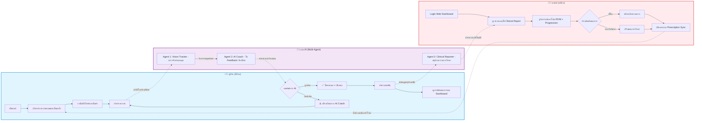

---
tags:
  - project/ai
  - project/healthcare
  - project/computer-vision
  - project/mobile-app
  - project/playstore
type: project-brief
status: active-development
created: 2026-06-18
priority: high
stack:
  - FastAPI
  - MySQL
  - MediaPipe
  - LLM
  - Tailwind
  - Capacitor/PWA
---
# 🏋️ AI-Driven Home Rehabilitation & Physical Therapy Tracker

> [!abstract] สรุปไอเดีย
> นำ Computer Vision (Pose Estimation) และ Multi-Agent System มาแก้ปัญหาการกายภาพบำบัดที่บ้าน (Home Rehabilitation) โดยเปลี่ยนกล้อง Smartphone/Webcam ให้เป็น "นักกายภาพบำบัด AI" ที่คอยตรวจจับท่าทาง คำนวณองศาการเคลื่อนไหว (Range of Motion) และให้ Feedback แบบ Real-time พร้อมสรุปผลส่งให้แพทย์ 
> **เป้าหมายสูงสุด:** พัฒนาเป็น Mobile Application และเผยแพร่บน **Play Store** เพื่อใช้งานจริงเชิงพาณิชย์

## 🎯 Pain Points ในวงการกายภาพบำบัดที่บ้าน
### 1. คนไข้ทำท่าผิดหรือทำไม่สุดระยะ (Poor Form & Limited ROM)
> [!problem] ปัญหา
> เมื่อคนไข้กลับไปทำกายภาพที่บ้าน มักทำท่าผิดๆ ถูกๆ หรือขยับไม่สุดระยะ (Range of Motion - ROM) ทำให้ฟื้นฟูช้า หรือร้ายแรงกว่านั้นคือ บาดเจ็บซ้ำ (Re-injury) เนื่องจากไม่มีผู้เชี่ยวชาญคอยประกบ

> [!solution] โอกาส Data/AI
> - **Data Capture:** ใช้กล้อง Smartphone
> - **AI Analytics:** ใช้ `Pose Estimation` ตรวจจับข้อต่อ (Joints) และคำนวณมุม (Kinematics) เพื่อเช็คว่าท่าถูกต้องและสุดระยะหรือไม่

### 2. ขาดแรงจูงใจและการติดตามผลระยะยาว (Lack of Motivation & Long-term Tracking)
> [!problem] ปัญหา
> การทำกายภาพเป็นเรื่องน่าเบื่อ คนไข้มักขาดแรงจูงใจ และแพทย์ไม่สามารถเห็นกราฟพัฒนาการที่ต่อเนื่องระหว่างคาบการรักษาได้

> [!solution] โอกาส Data/AI
> - **Integration (Gamification):** นำคะแนนความถูกต้อง (Accuracy Score) มาทำเป็นเกม เช่น ทำท่าถูกตัวละครถึงจะกระโดดข้ามสิ่งกีดขวางได้
> - **Time-Series & Predictive:** ใช้ `Time-Series Analysis` พล็อตกราฟพัฒนาการ และใช้ `Predictive Analytics` พยากรณ์ระยะเวลาฟื้นตัว (Recovery Forecast) หรือแจ้งเตือนเมื่อกราฟพัฒนาการ "แบนราบ" (Plateau)

---

## 🧠 Technical Strategy & CPE310 Alignment
> [!info] การแมปกับ Requirement วิชา CPE310
> โปรเจกต์นี้ครอบคลุมทั้ง Phase 1 (Core ML/DL) และ Phase 2 (Agentic AI) ตามที่หลักสูตรกำหนด

### 💡 Dataset Strategy: "ไม่ต้องหา Dataset ภาพเยอะ"
- ใช้ MediaPipe (Pre-trained) ดึง Joint จากวิดีโอ YouTube แนวกายภาพบำบัดฟรีๆ
- **Ground Truth:** ดึงเฟรมวิดีโอ -> รัน MediaPipe -> คำนวณมุมข้อต่อมาตรฐาน (Ideal Angles) -> บันทึกเป็น JSON Baseline
- **จุดแข็ง:** ลดเวลา Data Labeling 90% ใช้ Logic ทางเรขาคณิต (Geometry) แทน Deep Learning แบบ Train เอง

### 📊 Phase 1: Core ML/DL & Analytics
1. **Computer Vision (MediaPipe):** ตรวจจับ Skeleton tracking และคำนวณมุมข้อต่อแบบ Real-time
2. **Time-Series Analysis:** เก็บค่า ROM และ Accuracy Score รายวัน พล็อตเป็นกราฟแนวโน้มพัฒนาการ (Progression Curve)
3. **Predictive Analytics:** สร้างโมเดลถดถอย (Regression) หรือ Classification เพื่อพยากรณ์ว่า "หากคนไข้ทำท่านี้ครบ X ครั้งต่อสัปดาห์ จะใช้เวลากี่สัปดาห์ถึงจะกลับมาเดินได้ปกติ" หรือแจ้งเตือน "Risk of Re-injury"

### 🤖 Phase 2: Agentic AI Architecture (Multi-Agent System)
ระบบใช้ Multi-Agent System เพื่อแบ่งแยกหน้าที่ (Separation of Concerns):

- 📷 **Agent 1: Vision Tracker (The Eyes)**
  - **หน้าที่:** รับเฟรมจากกล้อง รัน MediaPipe ดึงพิกัด (x, y, z) ของข้อต่อ
  - **Output:** ส่งค่า Coordinates และคำนวณ Angle/Distance แบบ Real-time
- 🗣️ **Agent 2: AI Coach (The Brain)**
  - **หน้าที่:** LLM ที่รับค่ามุมข้อต่อ (JSON) เปรียบเทียบกับทฤษฎีกายภาพบำบัด (ดึงจาก RAG)
  - **Action:** Generate ข้อความ/เสียง (TTS) แบบ Real-time เช่น "งอเข่าอีกนิดครับ ขาดอีกประมาณ 1 คืบ"
  - **XAI Feature:** แสดงผลบน UI ว่า "ข้อผิดพลาด: มุมเข่า 120° (เป้าหมาย: 90°)"
- 📄 **Agent 3: Clinical Reporter (The Scribe)**
  - **หน้าที่:** เมื่อจบเซสชัน ดึง Log ความถูกต้อง, จำนวนครั้ง (Reps), และ ROM
  - **Output:** Generate เป็น Clinical Summary Report (PDF/JSON) ส่งให้แพทย์ผ่าน Web Dashboard

---

## 📱 Mobile & Play Store Strategy
> [!tip] การเตรียมแอปเพื่อลง Play Store
> เนื่องจาก Core เป็น Web-based (Tailwind + FastAPI) จะใช้กลยุทธ์ดังนี้:

1. **App Wrapper:** ใช้ **Capacitor** หรือ **PWA (Progressive Web App)** Wrap หน้าเว็บให้เป็น Native Android App เพื่ออัปโหลดขึ้น Play Store ได้
2. **On-Device Processing (สำคัญมาก):** รัน MediaPipe ผ่าน TensorFlow.js / MediaPipe JS ใน WebView ของมือถือ เพื่อไม่ให้ส่งภาพวิดีโอขึ้น Cloud (ลด Latency และแก้ปัญหา PDPA) ส่งขึ้น Server แค่ค่า JSON Coordinates
3. **Offline Mode:** รองรับการทำกายภาพแบบไม่มีอินเทอร์เน็ต โดยซิงค์ข้อมูลขึ้น Cloud เมื่อมีเครือข่าย (Sync Queue)
4. **App Store Optimization (ASO):** ตั้งชื่อแอปให้ค้นหาง่าย เช่น "AI Physio: กายภาพบำบัดที่บ้าน"

---

## 🎨 UI/UX Strategy: "Minimalist & Tech/Geek"
- **หน้า Live Camera:** แสดง Live Webcam + เส้น Skeleton ทับ + กราฟมุมข้อต่อแบบ Real-time (สไตล์ Oscilloscope)
- **Dashboard ผู้ป่วย:** แสดงกราฟ Time-Series พัฒนาการ, Streak (จำนวนวันที่ทำติดต่อกัน), และ Badge ความสำเร็จ
- **Dashboard แพทย์ (Web):** ใช้ Tailwind CSS + DaisyUI จัด Layout ให้ดูเป็น Professional Tool สำหรับดูรายงานจาก Agent 3

---
## Flowchart

---

## 🚀 Project Roadmap
### Step 1: Backend, Database & Mobile Setup
- [ ] ออกแบบ [[Database Schema]] (Users → Exercise Plans → Session Logs → Joint_Angle_Records)
- [ ] สร้าง FastAPI Endpoint สำหรับ Auth, Sync Data, และดึง Exercise Plans
- [ ] Setup โครงสร้าง Mobile App ด้วย Capacitor (Wrap Tailwind Frontend)

### Step 2: Computer Vision & Logic Module (Phase 1 Core)
- [ ] เขียน Python Script ดึงวิดีโอ YouTube -> Extract Ideal Angles (Ground Truth)
- [ ] เขียน Logic คำนวณมุมข้อต่อ (Angle Calculation using Vector Math) บน Frontend (JS)
- [ ] เช็คว่าทำท่าถูกไหม (Form Check) และสุดระยะไหม (ROM Check)
- [ ] Implement Time-Series Dashboard (กราฟพัฒนาการ)

### Step 3: Agentic AI & Predictive Integration (Phase 2 Core)
- [ ] เชื่อมต่อ Tracker Agent กับ Coach Agent (ใช้ LangChain / FastAPI LLM Endpoint)
- [ ] สร้าง Reporter Agent ให้สรุปผลเป็น Clinical Note
- [ ] สร้างโมเดล Predictive Analytics ง่ายๆ (เช่น Linear Regression) เพื่อพยากรณ์วันฟื้นตัว

### Step 4: Play Store Preparation & Launch
- [ ] ทำระบบ Sign-up / Login และหน้า **Privacy Policy / Terms of Service** (บังคับโดย Google Play)
- [ ] ขอ Permission กล้อง และ Microphone (สำหรับ TTS) อย่างถูกต้องตาม Android Guideline
- [ ] Build APK/AAB และทดสอบบนเครื่องจริง (Real-device Testing)
- [ ] อัปโหลดขึ้น Google Play Console (เตรียมรูป Screenshot, คำอธิบายแอป)

---

## ⚠️ ข้อควรระวัง (สำคัญมาก!)
> [!danger] 1. PDPA & Mobile Privacy
> - **ห้าม** ส่งภาพวิดีโอจากกล้องขึ้น Server เด็ดขาด ให้ประมวลผลที่เครื่อง (On-device) และส่งขึ้นแค่ค่า JSON (Landmarks)
> - ต้องมีหน้า Consent ที่ชัดเจนก่อนเปิดกล้อง และต้องมี Privacy Policy ที่อ่านง่ายบน Play Store

> [!warning] 2. Explainable AI (XAI) ในทางกายภาพ
> แพทย์และคนไข้จะไม่เชื่อ AI ที่บอกว่า "ทำถูก/ผิด" โดยไม่มีเหตุผล ระบบต้อง Highlight บน Skeleton ได้ว่า "ผิดตรงไหน" (เช่น แสดงเส้นสีแดงที่ข้อเข่า พร้อมตัวเลขมุม)

> [!tip] 3. Safety First (Human-in-the-loop)
> AI Coach ใช้สำหรับ "แนะนำและเตือน" เท่านั้น **ห้าม AI เปลี่ยนแปลงแผนการรักษา (Prescription) เองได้** การปรับระดับความหนัก-เบา ต้องให้แพทย์เป็นผู้ Approve ผ่าน Web Dashboard

> [!info] 4. Google Play Policies
> แอปสายสุขภาพ (Health & Fitness) ของ Google จะเข้มงวดเรื่องคำเคลม (Claims) ห้ามใช้คำว่า "รักษาหายขาด" (Cure) ให้ใช้คำว่า "ช่วยฟื้นฟู" (Support Rehabilitation) แทน

---

## 🎯 Impact
> [!success] ทำไมถึงอยากทำโปรเจกต์นี้
> 
> **เพราะเห็นคนใกล้ตัวทำกายภาพแล้วท้อ**
> 
> ทุกครั้งที่กลับบ้าน เห็นคุณปู่/คุณย่า (หรือคนในครอบครัว) นั่งทำท่ากายภาพซ้ำๆ อยู่คนเดียวหน้าทีวี บางทีก็ทำผิดท่า บางทีก็ขี้เกียจเพราะเจ็บ ไม่มีใครคอยบอกว่าจะต้องทำยังไงให้ถูก ไม่มีใครคอยให้กำลังใจ 
> 
> แล้วพอถึงวันนัดหมอ ก็ต้องนั่งเล่าจากความทรงจำว่า "ช่วงนี้ทำได้ดีขึ้นนะ" แต่จริงๆ แล้วดีขึ้นแค่ไหน? ทำครบทุกท่าไหม? ไม่มีใครรู้เลย นอกจากตัวคนไข้เอง
> 
> **สิ่งที่อยากเห็น:**
> - คนไข้ทำกายภาพที่บ้านได้โดยไม่ต้องพึ่งนักกายฯ ตลอดเวลา
> - มี AI คอยบอกแบบเป็นกันเองว่า "งอเข่าอีกนิดนะ" ไม่ใช่แค่จับผิด
> - ผู้สูงอายุไม่รู้สึกโดดเดี่ยวเวลาต้องฝึกคนเดียว
> - แพทย์เห็นข้อมูลจริง ไม่ใช่แค่ฟังจากคนไข้
> 
> **ไม่ใช่แค่โปรเจกต์ส่งอาจารย์** แต่อยากทำให้อัปขึ้น Play Store ให้คนอื่นได้ใช้จริงๆ แม้จะเป็นแค่แอปเล็กๆ ที่ช่วยให้ใครสักคนทำกายภาพได้ดีขึ้นวันละนิด ก็คุ้มค่าแล้ว

---
## 🔗 Related Notes
- [[Range of Motion (ROM)]] — เกณฑ์การขยับข้อต่อ
- [[MediaPipe]] — Library สำหรับ Pose Estimation
- [[Kinematics Math]] — การคำนวณมุมจาก Vector 3 จุด
- [[LangChain Agents]] — การสร้าง Multi-Agent System
- [[Capacitor JS]] — การ Wrap Web App เป็น Mobile App
- [[Google Play Console]] — ขั้นตอนการอัปโหลดแอป